<div align="center">
  <!-- Introduction -->
  
  <h1>
    <b>✨ Lan Anh's 3D Developer Portfolio ✨</b>
  </h1>
  <p>
    A dynamic and interactive personal portfolio built with Next.js, Framer Motion, and Three.js, designed to showcase my journey and skills as a modern Web Developer.
  </p>

<!-- Badges -->

<a href="https://dhlananh-dev-portfolio.vercel.app/" target="_blank">
    
  </a>
  
  
  <a href="https://github.com/dhlananhh/my-3d-portfolio/blob/main/LICENSE.md" target="_blank">
    
  </a>
</div>

---

## 🚀 About This Project

Welcome to the source code of my personal portfolio! This project isn't just a list of my accomplishments; it's a testament to my skills, my passion for clean code, and my eye for engaging user experiences. I built this from the ground up using a modern tech stack to create a fast, responsive, and visually stunning platform to tell my professional story.

### ▶️ [View Live Demo](https://dhlananh-dev-portfolio.vercel.app/)

---

## 🌟 Key Features

This portfolio is packed with features designed to provide a rich, interactive experience:

- **Interactive 3D Elements:**

  - 🌌 **3D Starfield Background:** An animated starfield in the Hero section created with `react-three-fiber`.
  - 💧 **Interactive Fluid Cursor:** A dynamic WebGL splash effect that follows the user's cursor across the entire site.
- **Advanced Animations & UI/UX:**

  - **Dynamic Gradient Text:** An eye-catching, animated gradient for the main headline.
  - **Seamless Page Transitions:** Smooth and elegant transitions between sections powered by `Framer Motion`.
  - **Glow-on-Hover Effects:** Subtle, beautiful glows on interactive elements like the FAQ and GitHub graph cards.
  - **Infinite Testimonial Marquee:** An auto-scrolling, infinite carousel for testimonials that pauses on hover.
- **Dynamic & Live Data:**

  - **Project Filtering:** A dynamic grid that allows users to filter projects by category (Web, AI, Mobile).

  * **Live GitHub Contribution Graph:** Fetches and displays my GitHub contribution history, with the ability to view data by year (2025, 2024, 2023).
- **Comprehensive Project Showcase:**

  - **Detailed Project Pages:** Dynamic routes (`/projects/[slug]`) provide an in-depth look at each project, including goals, tech stack, and image galleries.
  - **Accordion FAQ Section:** An interactive and cleanly designed FAQ section to answer common questions.
- **Core Functionalities:**

  * **Fully Responsive Design:** A pixel-perfect experience on all devices, from mobile phones to widescreen desktops.
  * **Working Contact Form:** A functional contact form with client-side validation and toast notifications for success/error states.

---

## 🛠️ Tech Stack

This portfolio was built using a modern, scalable, and high-performance technology stack:

| Category              | Technologies                                                                                 |
| :-------------------- | :------------------------------------------------------------------------------------------- |
| **Core**              | `Next.js 15`, `React 19`, `TypeScript`                                                       |
| **Styling**           | `Tailwind CSS`, `Shadcn UI`, `Radix UI`                                                      |
| **Icons**             | `Lucide React`, `React Icons`                                                                |
| **Animation**         | `Framer Motion`, `React Three Fiber (@react-three/drei)`, `React Bits`, `Magic UI`           |
| **APIs & Data**       | `react-github-calendar` (for GitHub Contributions Graph), `Web3Forms` (for Contact Form)     |
| **Tooling**           | `ESLint`, `Prettier`, `pnpm`, `bun`, `yarn`                                                  |
| **Deployment**        | `Vercel`                                                                                     |

---

## 🏁 Getting Started

To get a local copy up and running, follow these simple steps.

### Prerequisites

Before you begin, ensure you have the following tools installed on your system. This project supports both **Bun** (recommended for speed) and **Yarn**.

1.  **Node.js**: Make sure you have Node.js version 18.x or later. You can download it from the [official Node.js website](https://nodejs.org/). To check your version, run:
    ```bash
    node -v
    ```

2.  **Bun** (Recommended): Bun is a fast all-in-one JavaScript runtime. To install it, run the following command in your terminal:
    ```bash
    # For macOS, Linux, and WSL
    curl -fsSL https://bun.sh/install | bash
    
    # For Windows, you can use PowerShell
    powershell -c "irm bun.sh/install.ps1|iex"
    ```
    *For other installation methods, please refer to the [official Bun documentation](https://bun.sh/docs/installation).*

3.  **Yarn** (Alternative): If you prefer to use Yarn, you can install it via npm:
    ```bash
    npm install --global yarn
    ```
    To check your version, run: `yarn --version`

### Installation

Once the prerequisites are met, follow these steps:

1.  **Clone the repository:**
    ```bash
    git clone https://github.com/dhlananhh/my-3d-portfolio.git
    ```

2.  **Navigate to the project directory:**
    ```bash
    cd my-3d-portfolio
    ```

3.  **Install dependencies:**
    Choose **one** of the following commands based on the package manager you want to use.

    *Using Bun (Recommended):*
    ```bash
    bun install
    ```

    *Using Yarn:*
    ```bash
    yarn install
    ```

4.  **Set up environment variables:**
    - Create a new file named `.env.local` in the root of the project.
    - Add your Web3Forms Access Key to this file. This is needed for the contact form to work.
    ```env
    NEXT_PUBLIC_WEB3FORMS_ACCESS_KEY=YOUR_WEB3FORMS_ACCESS_KEY_HERE
    ```

5.  **Run the development server:**
    This command will start the Next.js development server with Turbopack.

    *Using Bun:*
    ```bash
    bun dev
    ```

    *Using Yarn:*
    ```bash
    yarn dev
    ```

Open [http://localhost:3000](http://localhost:3000) with your browser to see the result.

---

## 📂 Folder Structure

The project's folder structure is organized to be clean, modular, and scalable, following modern Next.js conventions:

```
├── public/                             # Publicly accessible static assets
│ ├── images/                           # General project images and logos
│ ├── resume/                           # Resume files (e.g., PDF)
│ └── screenshots/                      # Screenshots for README documentation
│ 
└── src/                                # Main application source code
  ├── app/                              # App Router: Pages, Layout, API Routes
  │ ├── (main)/                         # Main route group for pages with shared layout
  │ │ ├── layout.tsx
  │ │ └── page.tsx                      # Homepage
  │ │
  │ └── projects/                       # Dynamic routes for project details
  │   └── [slug]/
  │     └── page.tsx
  │
  ├── assets/                           # For future static assets like custom fonts or SVGs (currently empty)
  │
  ├── components/                       # Reusable UI components
  │
  │ ├── blocks/                         # Complex, multi-part components or animations
  │ │ ├── Animations/
  │ │ └── TextAnimations/
  │ │
  │ ├── custom-ui/                      # Custom-designed, non-Shadcn components
  │ │ ├── ContactForm.tsx
  │ │ ├── GlassmorphicCard.tsx
  │ │ ├── ProjectForm.tsx
  │ │ ├── SkillBadge.tsx
  │ │ └── TestimonialCard.tsx
  │ │
  │ ├── layout/                         # Main layout components (Navbar, Footer)
  │ │ ├── Footer.tsx
  │ │ └── Navbar.tsx
  │ │
  │ ├── magicui/                        # Integrated components from Magic UI library
  │ │ └── typing-animation.tsx
  │ ├── sections/                       # Major homepage sections (Hero, About, Projects, etc.)
  │ │
  │ └── ui/                             # Reusable UI primitives, often from Shadcn UI (e.g., Button)
  │
  ├── hooks/                            # Custom React hooks for shared logic
  │ ├── use-mobile.tsx
  │ └── use-toast.ts
  │
  ├── lib/                              # Library functions, helpers, and data
  │ ├── data.ts                         # Centralized data for projects, skills, etc.
  │ ├── images.ts                       # Centralized module for static image assets
  │ └── utils.ts                        # Utility functions (e.g., cn for class names)
  │
  └── styles/                           # 🎨 Styling: Global styles and theme configuration.
    ├── globals.css                     # - Core global styles and custom CSS for libraries.
    └── tailwind.config.ts              # - Tailwind CSS theme configuration (colors, fonts, plugins).
```

---

## 🚀 Deployment

This portfolio is deployed on **Vercel**, the creators of Next.js. The deployment process is fully automated through Vercel's Git integration. Every push to the `main` branch automatically triggers a new deployment, ensuring the live site is always up-to-date with the latest changes.

---

## 📸 Screenshots

Here's a visual tour of the portfolio, showcasing its key sections and clean, modern design. Each screenshot highlights a different part of the user experience, from the interactive hero section to the detailed project pages.

### Hero Section

*A captivating first impression with an animated 3D starfield and dynamic gradient text.*
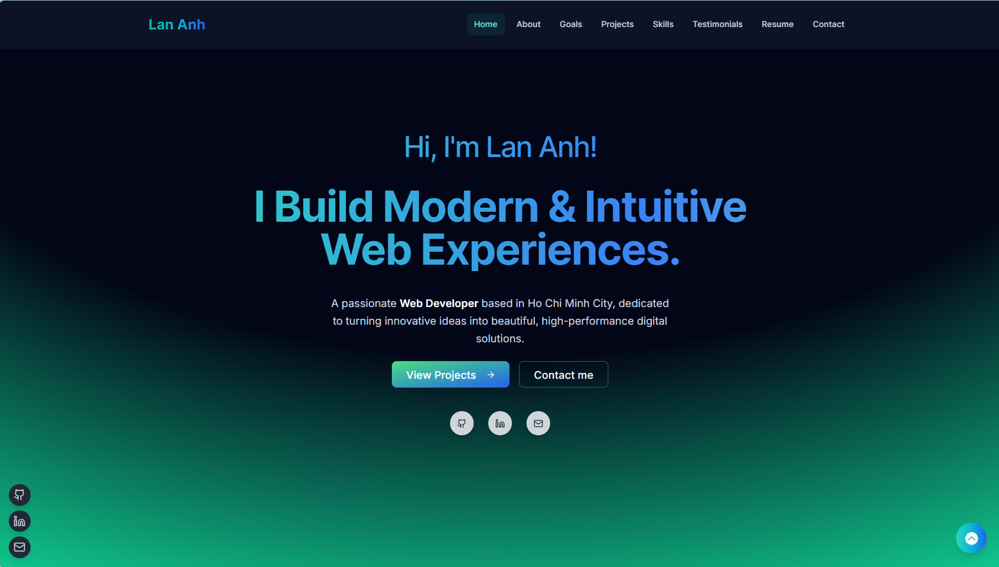

---

### About Me Section

*A personal introduction presented in a professional and visually appealing layout.*
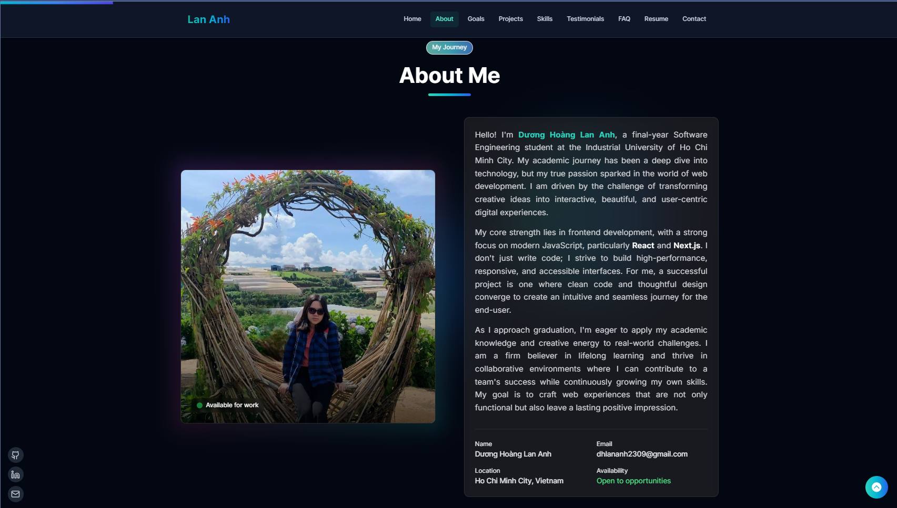

---

### Career Goals Section

*Clearly defined short, mid, and long-term career ambitions.*
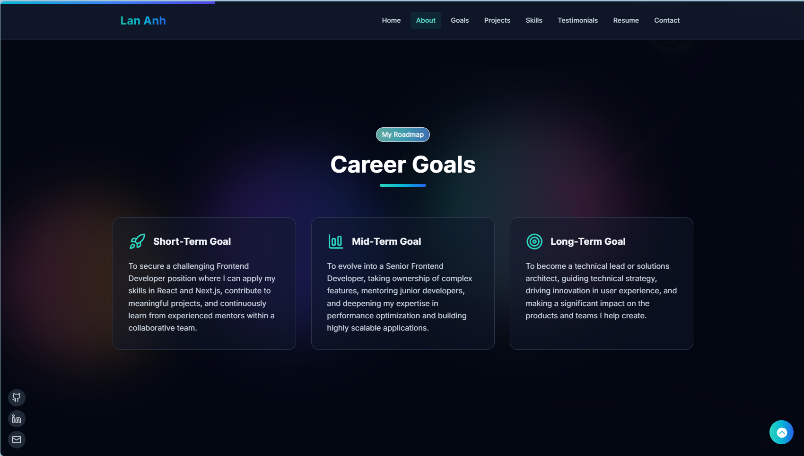

---

### Projects Section

*An interactive grid showcasing my work, with dynamic filtering by category.*
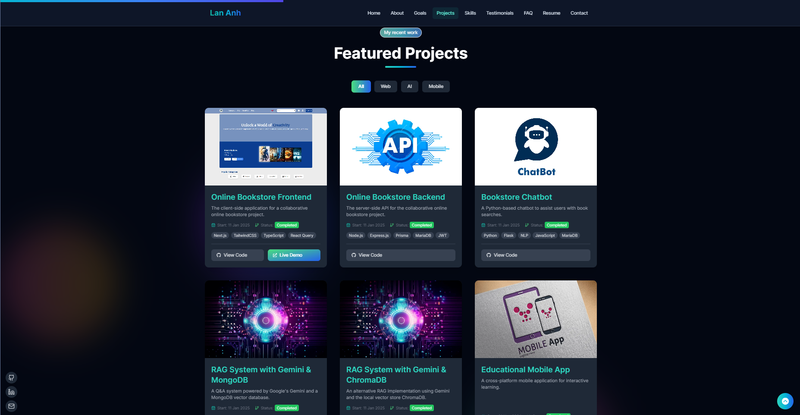

---

### Skills Section

*A structured overview of my technical abilities, grouped by expertise.*
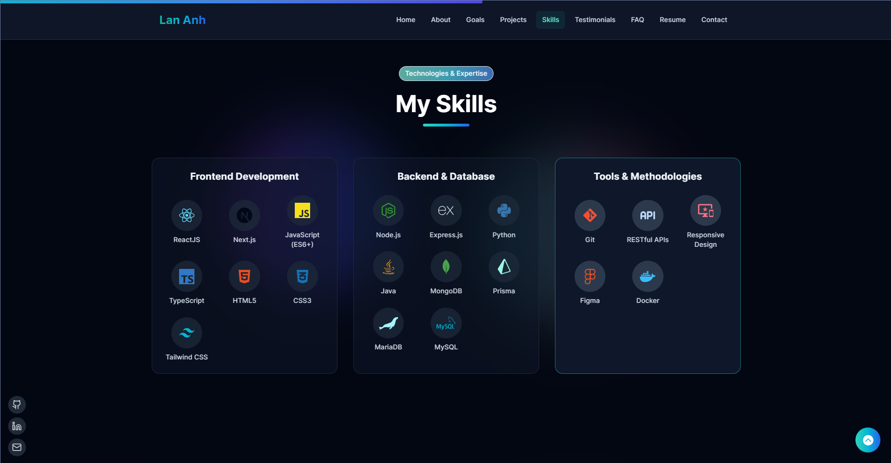

---

### GitHub Contributions

*A live, interactive graph of my dedication and coding consistency.*
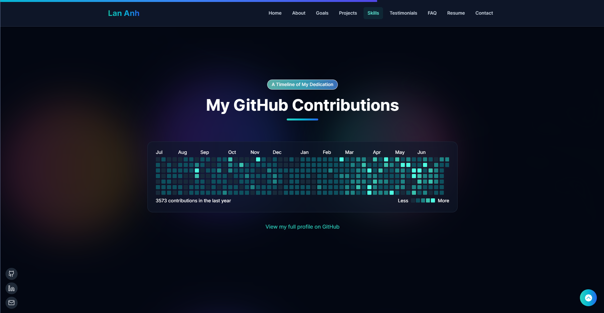

---

### Testimonials Section

*An infinite scrolling marquee of praise from collaborators and colleagues.*
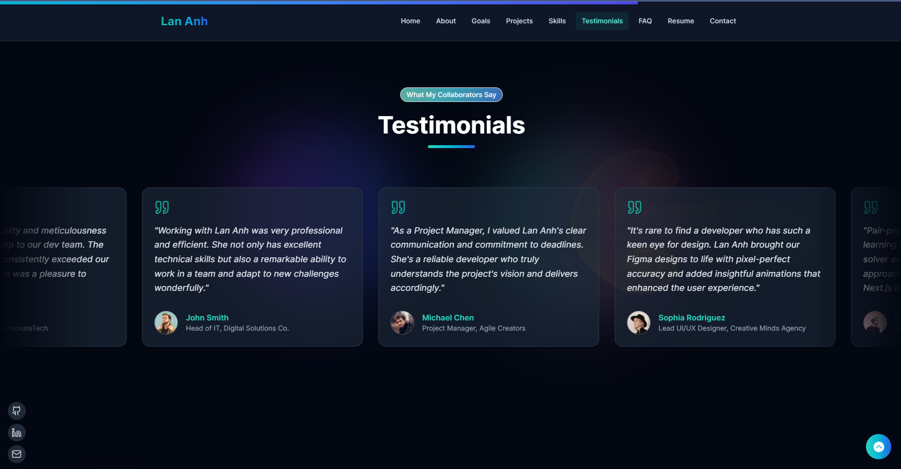

---

### FAQ Section

*An interactive accordion to answer common questions with a glow-on-hover effect.*
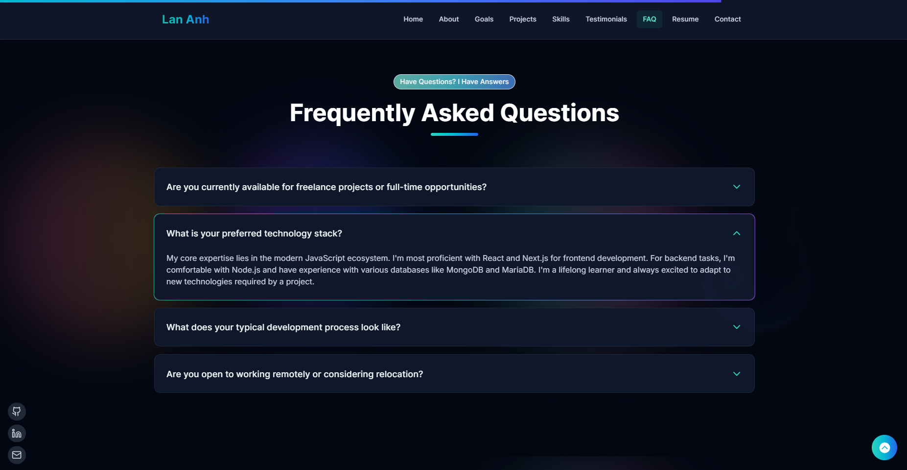

---

### Resume Section

*A dedicated space for my professional resume, allowing for easy viewing and downloading.*
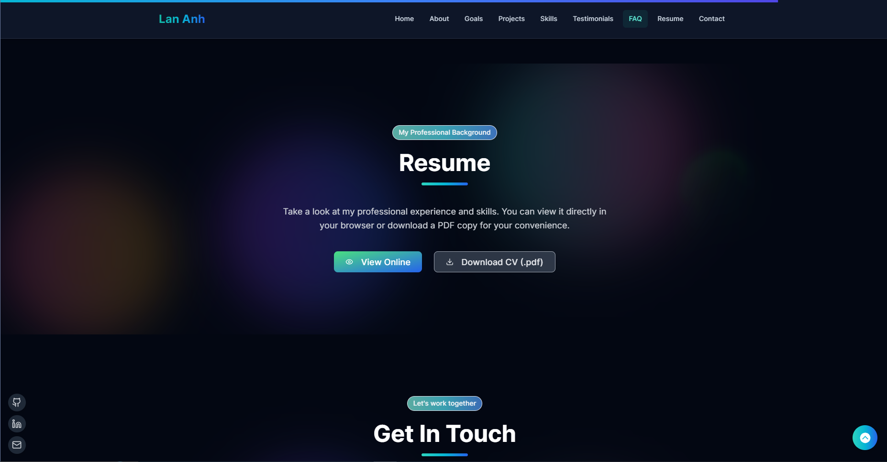

---

### Contact Section

*A functional contact form with client-side validation and seamless toast notifications for status feedback.*
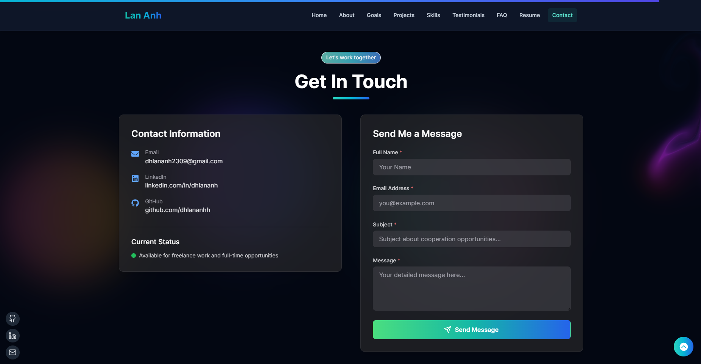

---

### Project Details Page

*A deep dive into each project, featuring a rich, case-study-style layout.*
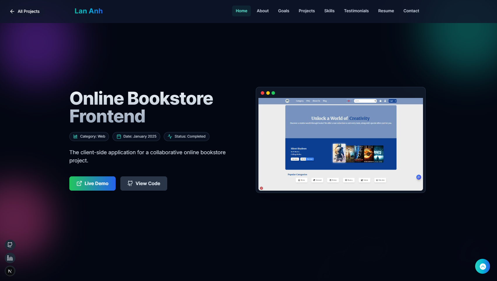
*Visual gallery with interactive controls to showcase more of the project's interface.*
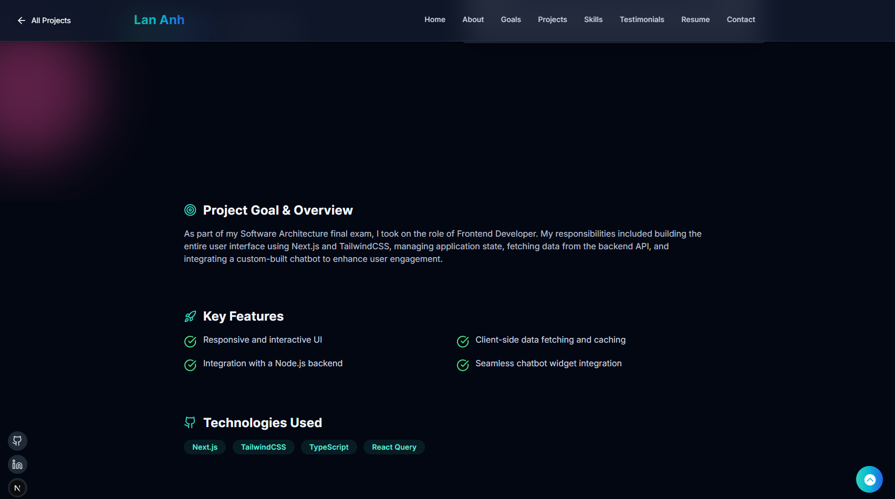
*Detailed breakdown of features and technologies used.*
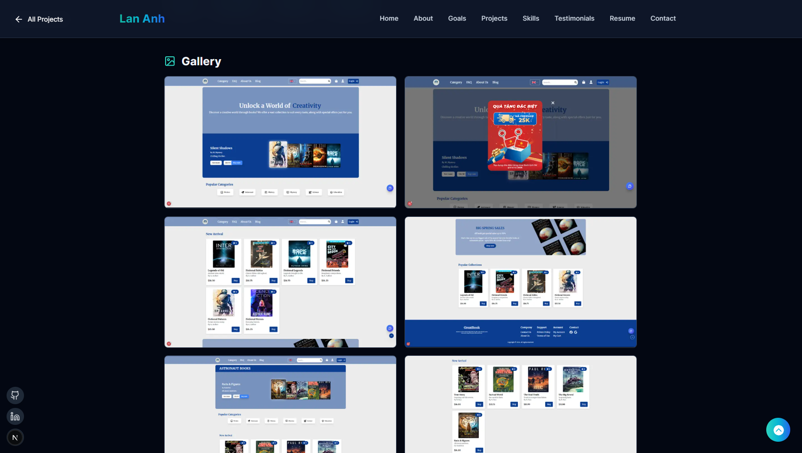

---

### Email Notification System

*Proof of the fully functional contact system: a real email received from the portfolio via the Web3Forms service.*
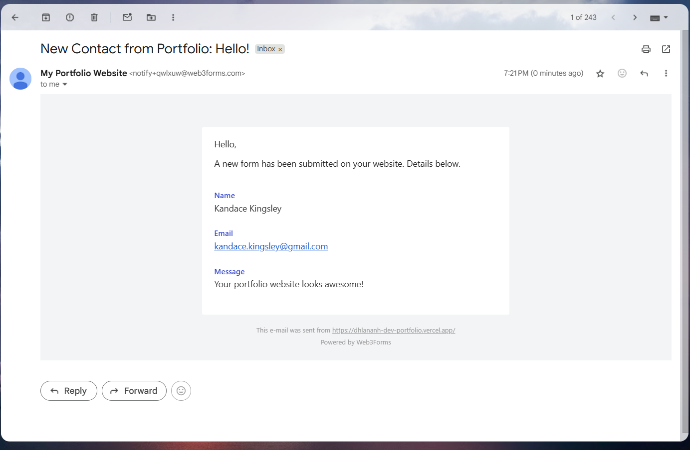

---

## 📩 Contact

<p>
  I'm currently seeking new opportunities as a Junior Developer. If you're interested in my work or have any questions, please feel free to connect with me!
</p>

<div align="left">
  <a href="https://linkedin.com/in/dhlananh" target="_blank" rel="noopener noreferrer">
    
  </a>
  <a href="mailto:dhlananh2309@gmail.com">
    
  </a>
  <a href="https://github.com/dhlananhh">
    
  </a>
</div>

<p>
  Thank you for taking the time to explore my portfolio and its source code. This project was a labor of love, and I hope it effectively showcases my skills and passion for modern web development. If you found it interesting or valuable, leaving a star on the repository would be much appreciated!
</p>
